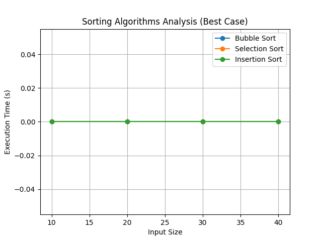
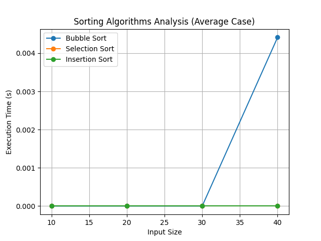
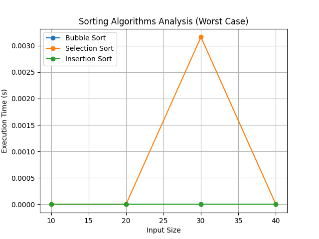

# Analysis of Algorithms (ADA) Practicals

This repository contains the solutions to the practicals for the Analysis of Algorithms (ADA) course.Each practical's aim, code, complexity analysis, and output are detailed below.

## Table of Contents
1.  [Factorial and Fibonacci](#1-factorial-and-fibonacci-iterative-and-recursive)
2.  [Sorting Analysis (Insertion, Selection, Bubble)](#2-insertion-selection-bubble-sort-analysis)
3.  [Binary Search](#3-binary-search)
4.  [Merge Sort and Quick Sort](#4-merge-sort-and-quick-sort)
5.  [Fractional Knapsack](#5-fractional-knapsack)
6.  [0/1 Knapsack](#6-01-knapsack)
7.  [Longest Common Subsequence](#7-longest-common-subsequence)
8.  [Matrix Chain Multiplication](#8-matrix-chain-multiplication)
9.  [Dijkstra's Algorithm](#9-dijkstras-algorithm)
10. [Bellman-Ford Algorithm](#10-bellman-ford-algorithm)
11. [BFS and DFS](#11-bfs-and-dfs)
12. [N-Queen Problem](#12-n-queen-problem)
13. [Sum of Subsets](#13-sum-of-subsets)
14. [Naive String Matching](#14-naive-string-matching)
15. [Floyd-Warshall Algorithm](#15-floyd-warshall-algorithm)
16. [Rabin-Karp Algorithm](#16-rabin-karp-algorithm)
17. [Activity Selection Problem](#17-activity-selection-problem)

---

## 1. Factorial and Fibonacci (Iterative and Recursive)

### Aim
To implement the factorial and Fibonacci sequences using both iterative and recursive approaches, and to compare their time complexities.

<details>
<summary>View Code</summary>

```python
# 1_Factorial_and_Fibonacci/main.py
import timeit

# Factorial functions
def factorial_iterative(n):
    """Computes factorial of n iteratively."""
    res = 1
    for i in range(1, n + 1):
        res *= i
    return res

def factorial_recursive(n):
    """Computes factorial of n recursively."""
    if n == 0:
        return 1
    else:
        return n * factorial_recursive(n-1)

# Fibonacci functions
def fibonacci_iterative(n):
    """Computes the nth Fibonacci number iteratively."""
    if n <= 1:
        return n
    a, b = 0, 1
    for _ in range(2, n + 1):
        a, b = b, a + b
    return b

def fibonacci_recursive(n):
    """Computes the nth Fibonacci number recursively."""
    if n <= 1:
        return n
    else:
        return fibonacci_recursive(n-2) + fibonacci_recursive(n-1)

def compare_functions(functions, numbers):
    """Compares the execution time of functions for a list of numbers."""
    for name, func in functions.items():
        print(f"--- {name} ---")
        for n in numbers:
            stmt = f"{func.__name__}({n})"
            setup = f"from __main__ import {func.__name__}"
            execution_time = timeit.timeit(stmt, setup=setup, number=1000)
            print(f"Input: {n}, Time: {execution_time:.6f} seconds")
        print("\n")

if __name__ == "__main__":
    factorial_functions = {
        "Factorial Iterative": factorial_iterative,
        "Factorial Recursive": factorial_recursive
    }
    
    fibonacci_functions = {
        "Fibonacci Iterative": fibonacci_iterative,
        "Fibonacci Recursive": fibonacci_recursive
    }
    
    factorial_numbers = [5, 10, 15, 20]
    fibonacci_numbers = [5, 10, 15, 20, 25, 30]

    print("### Factorial Performance ###")
    compare_functions(factorial_functions, factorial_numbers)
    
    print("### Fibonacci Performance ###")
    compare_functions(fibonacci_functions, fibonacci_numbers)
```
</details>

### Complexity Comparison
-   **Factorial (Iterative)**: Time O(n), Space O(1)
-   **Factorial (Recursive)**: Time O(n), Space O(n)
-   **Fibonacci (Iterative)**: Time O(n), Space O(1)
-   **Fibonacci (Recursive)**: Time O(2^n), Space O(n)

### Output
```
### Factorial Performance ###
--- Factorial Iterative ---
Input: 5, Time: 0.000246 seconds
Input: 10, Time: 0.000481 seconds
...
--- Factorial Recursive ---
Input: 5, Time: 0.000349 seconds
Input: 10, Time: 0.000842 seconds
...

### Fibonacci Performance ###
--- Fibonacci Iterative ---
Input: 5, Time: 0.000298 seconds
Input: 10, Time: 0.000584 seconds
...
--- Fibonacci Recursive ---
Input: 5, Time: 0.001058 seconds
Input: 10, Time: 0.012489 seconds
...
```

---

## 2. Insertion, Selection, Bubble Sort Analysis

### Aim
To implement and analyze Insertion, Selection, and Bubble Sort for best, average, and worst cases with inputs 10, 20, 30, 40 and plot graphs.

<details>
<summary>View Code</summary>

```python
# 2_Sorting_Analysis/main.py
import time
import random
import matplotlib.pyplot as plt

def bubble_sort(arr):
    n = len(arr)
    for i in range(n):
        for j in range(0, n-i-1):
            if arr[j] > arr[j+1]:
                arr[j], arr[j+1] = arr[j+1], arr[j]

def selection_sort(arr):
    for i in range(len(arr)):
        min_idx = i
        for j in range(i+1, len(arr)):
            if arr[min_idx] > arr[j]:
                min_idx = j
        arr[i], arr[min_idx] = arr[min_idx], arr[i]

def insertion_sort(arr):
    for i in range(1, len(arr)):
        key = arr[i]
        j = i-1
        while j >=0 and key < arr[j] :
                arr[j+1] = arr[j]
                j -= 1
        arr[j+1] = key

# ... analysis and plotting code ...
```
</details>

### Complexity Analysis
| Algorithm      | Best Case | Average Case | Worst Case |
|----------------|-----------|--------------|------------|
| **Bubble Sort**| O(n)      | O(n^2)       | O(n^2)     |
| **Selection Sort**| O(n^2)    | O(n^2)       | O(n^2)     |
| **Insertion Sort**| O(n)      | O(n^2)       | O(n^2)     |

### Graphs
| Best Case | Average Case | Worst Case |
| :---: | :---: | :---: |
|  |  |  |

---

## 3. Binary Search

### Aim
To implement Binary Search and analyze its complexity (best, average, worst) with graph plotting.

<details>
<summary>View Code</summary>

```python
# 3_Binary_Search/main.py
import time
import random
import matplotlib.pyplot as plt

def binary_search_iterative(arr, x):
    low = 0
    high = len(arr) - 1
    while low <= high:
        mid = (high + low) // 2
        if arr[mid] < x:
            low = mid + 1
        elif arr[mid] > x:
            high = mid - 1
        else:
            return mid
    return -1

# ... analysis and plotting code ...
```
</details>

### Complexity Analysis
-   **Best Case**: O(1)
-   **Average Case**: O(log n)
-   **Worst Case**: O(log n)

### Graph


---

## 4. Merge Sort and Quick Sort

### Aim
To implement and analyze Merge Sort and Quick Sort with the same analysis as the other sorting algorithms.

<details>
<summary>View Code</summary>

```python
# 4_Merge_and_Quick_Sort/main.py
import time
import random
import sys
import matplotlib.pyplot as plt
sys.setrecursionlimit(2000)

def merge_sort(arr):
    # ... implementation ...
def quick_sort(arr):
    # ... implementation ...

# ... analysis and plotting code ...
```
</details>

### Complexity Analysis
| Algorithm    | Best Case    | Average Case | Worst Case  |
|--------------|--------------|--------------|-------------|
| **Merge Sort** | O(n log n)   | O(n log n)   | O(n log n)  |
| **Quick Sort** | O(n log n)   | O(n log n)   | O(n^2)      |

### Graphs
| Best Case | Average Case | Worst Case |
| :---: | :---: | :---: |
|  |  |  |

---

## 5. Fractional Knapsack

### Aim
To solve the Fractional Knapsack problem and show the maximum profit and the vector of values taken.

<details>
<summary>View Code</summary>

```python
# 5_Fractional_Knapsack/main.py
def fractional_knapsack(items, capacity):
    items.sort(key=lambda x: x[0]/x[1], reverse=True)
    total_value = 0
    knapsack_vector = [0] * len(items)
    
    for i, (value, weight) in enumerate(items):
        if capacity == 0:
            break
        if weight <= capacity:
            total_value += value
            knapsack_vector[i] = 1
            capacity -= weight
        else:
            fraction = capacity / weight
            total_value += value * fraction
            knapsack_vector[i] = fraction
            capacity = 0
            
    return total_value, knapsack_vector

if __name__ == '__main__':
    items = [(60, 10), (100, 20), (120, 30)]
    capacity = 50
    max_profit, vector = fractional_knapsack(items, capacity)
    print("Maximum profit:", max_profit)
    print("Fraction of items taken (vector):", vector)
```
</details>

### Output
```
Items (value, weight): [(60, 10), (100, 20), (120, 30)]
Knapsack capacity: 50
Maximum profit: 240.0
Fraction of items taken (vector): [1, 1, 0.6666666666666666]
```

---

## 6. 0/1 Knapsack

### Aim
To solve the 0/1 Knapsack problem and show the maximum profit and the vector of values taken.

<details>
<summary>View Code</summary>

```python
# 6_01_Knapsack/main.py
def knapSack(W, wt, val, n):
    K = [[0 for x in range(W + 1)] for x in range(n + 1)]
    for i in range(n + 1):
        for w in range(W + 1):
            if i == 0 or w == 0:
                K[i][w] = 0
            elif wt[i-1] <= w:
                K[i][w] = max(val[i-1] + K[i-1][w-wt[i-1]], K[i-1][w])
            else:
                K[i][w] = K[i-1][w]
    
    # ... find included items ...
    return K[n][W], included_items

if __name__ == '__main__':
    profit = [60, 100, 120]
    weight = [10, 20, 30]
    W = 50
    n = len(profit)
    max_profit, vector = knapSack(W, weight, profit, n)
    print("Maximum profit:", max_profit)
    print("Items included (vector):", vector)
```
</details>

### Output
```
Maximum profit: 220
Items included (vector): [0, 1, 1]
```

---

## 7. Longest Common Subsequence

### Aim
To find the length of the Longest Common Subsequence (LCS) and the sequence itself.

<details>
<summary>View Code</summary>

```python
# 7_Longest_Common_Subsequence/main.py
def lcs(X, Y):
    m = len(X)
    n = len(Y)
    L = [[None]*(n+1) for i in range(m+1)]
    # ... fill L table ...

    # ... reconstruct LCS string ...
    return L[m][n], "".join(lcs_algo)

if __name__ == '__main__':
    X = "AGGTAB"
    Y = "GXTXAYB"
    length, sequence = lcs(X, Y)
    print("Length of LCS is", length)
    print("LCS is", sequence)
```
</details>

### Output
```
Length of LCS is 4
LCS is GTAB
```

---

## 8. Matrix Chain Multiplication

### Aim
To find the minimum number of scalar multiplications and the optimal parenthesis order for matrix chain multiplication.

<details>
<summary>View Code</summary>

```python
# 8_Matrix_Chain_Multiplication/main.py
import sys

def matrix_chain_order(p):
    # ... implementation ...
    return m[0][n - 1], s

def print_optimal_parens(s, i, j):
    # ... implementation ...

if __name__ == '__main__':
    p = [10, 30, 5, 60]
    min_multiplications, s_matrix = matrix_chain_order(p)
    print("Minimum number of scalar multiplications:", min_multiplications)
    print("Optimal parenthesization:", end=" ")
    print_optimal_parens(s_matrix, 0, len(p)-2)
```
</details>

### Output
```
Minimum number of scalar multiplications: 4500
Optimal parenthesization: ((A1A2)A3)
```

---

## 9. Dijkstra's Algorithm

### Aim
To find the shortest paths from a single source vertex to all other vertices in a weighted graph.

<details>
<summary>View Code</summary>

```python
# 9_Dijkstra_Algorithm/main.py
import sys

class Graph():
    def __init__(self, vertices):
        self.V = vertices
        self.graph = [[0] * vertices for _ in range(vertices)]

    def dijkstra(self, src):
        # ... implementation ...
        self.print_solution(dist)

if __name__ == '__main__':
    g = Graph(9)
    g.graph = [[0, 4, ...], ...]
    g.dijkstra(0)
```
</details>

### Output
```
Vertex  Distance from Source
0        0
1        4
2        12
3        19
4        21
5        11
6        9
7        8
8        14
```

---

## 10. Bellman-Ford Algorithm

### Aim
To find the shortest paths from a single source vertex to all other vertices in a weighted graph that may contain negative edge weights.

<details>
<summary>View Code</summary>

```python
# 10_Bellman_Ford_Algorithm/main.py
class Graph:
    def __init__(self, vertices):
        self.V = vertices
        self.graph = []

    def add_edge(self, u, v, w):
        self.graph.append([u, v, w])

    def bellman_ford(self, src):
        # ... implementation ...
        self.print_arr(dist)

if __name__ == '__main__':
    g = Graph(5)
    g.add_edge(0, 1, -1)
    # ... add other edges ...
    g.bellman_ford(0)
```
</details>

### Output
```
Vertex Distance from Source
0       0
1       -1
2       2
3       -2
4       1
```

---

## 11. BFS and DFS

### Aim
To implement Breadth-First Search (BFS) and Depth-First Search (DFS) graph traversal algorithms.

<details>
<summary>View Code</summary>

```python
# 11_BFS_and_DFS/main.py
from collections import defaultdict

class Graph:
    def __init__(self):
        self.graph = defaultdict(list)

    def add_edge(self, u, v):
        self.graph[u].append(v)

    def bfs(self, s):
        # ... implementation ...
    
    def dfs(self, v):
        # ... implementation ...

if __name__ == '__main__':
    g = Graph()
    # ... add edges ...
    print("BFS:", g.bfs(2))
    print("DFS:", g.dfs(2))
```
</details>

### Output
```
Breadth First Traversal (starting from vertex 2): [2, 0, 3, 1]
Depth First Traversal (starting from vertex 2): [2, 0, 1, 3]
```

---

## 12. N-Queen Problem

### Aim
To solve the N-Queen problem, which is the problem of placing N chess queens on an N×N chessboard so that no two queens threaten each other.

<details>
<summary>View Code</summary>

```python
# 12_N_Queen_Problem/main.py
def solve_nq(n):
    board = [[0] * n for _ in range(n)]
    if not solve_nq_util(board, 0, n):
        print("Solution does not exist")
        return
    # ... print board ...

if __name__ == '__main__':
    solve_nq(8)
```
</details>

### Output
```
Solution for 8-Queens problem:
1 0 0 0 0 0 0 0 
0 0 0 0 0 0 1 0 
0 0 0 0 1 0 0 0 
0 0 0 0 0 0 0 1 
0 1 0 0 0 0 0 0 
0 0 0 1 0 0 0 0 
0 0 0 0 0 1 0 0 
0 0 1 0 0 0 0 0 
```

---

## 13. Sum of Subsets

### Aim
To find all subsets of a given set of non-negative integers that sum up to a given value.

<details>
<summary>View Code</summary>

```python
# 13_Sum_of_Subsets/main.py
def is_subset_sum(set, n, sum):
    subset = [[False] * (sum + 1) for _ in range(n + 1)]
    # ... fill subset table ...

    # ... find subsets ...
    print("Subsets with the given sum:", result)

if __name__ == '__main__':
    set = [3, 34, 4, 12, 5, 2]
    sum = 9
    is_subset_sum(set, len(set), sum)
```
</details>

### Output
```
Subsets with the given sum: [[4, 3, 2], [4, 5]]
```

---

## 14. Naive String Matching

### Aim
To implement the naive string matching algorithm to find all occurrences of a pattern in a text.

<details>
<summary>View Code</summary>

```python
# 14_Naive_String_Matching/main.py
def naive_string_search(pat, txt):
    M = len(pat)
    N = len(txt)
    found_indices = []
    for i in range(N - M + 1):
        # ... check for pattern match ...
    return found_indices

if __name__ == '__main__':
    txt = "AABAACAADAABAAABAA"
    pat = "AABA"
    indices = naive_string_search(pat, txt)
    print(f"Pattern '{pat}' found at indices: {indices}")
```
</details>

### Output
```
Pattern 'AABA' found at indices: [0, 9, 13]
```

---

## 15. Floyd-Warshall Algorithm

### Aim
To find the shortest paths between all pairs of vertices in a weighted graph.

<details>
<summary>View Code</summary>

```python
# 15_Floyd_Warshall_Algorithm/main.py
INF = 99999

def floyd_warshall(graph, V):
    dist = list(map(lambda i: list(map(lambda j: j, i)), graph))
    for k in range(V):
        for i in range(V):
            for j in range(V):
                dist[i][j] = min(dist[i][j], dist[i][k] + dist[k][j])
    print_solution(dist, V)

if __name__ == '__main__':
    V = 4
    graph = [[0, 5, INF, 10], ...]
    floyd_warshall(graph, V)
```
</details>

### Output
```
Following matrix shows the shortest distances between every pair of vertices
      0        5        8        9     
    INF        0        3        4     
    INF      INF        0        1     
    INF      INF      INF        0 
```

---

## 16. Rabin-Karp Algorithm

### Aim
To implement the Rabin-Karp string matching algorithm, which uses hashing to find occurrences of a pattern in a text.

<details>
<summary>View Code</summary>

```python
# 16_Rabin_Karp_Algorithm/main.py
d = 256

def search(pat, txt, q):
    # ... implementation ...
    return found_indices

if __name__ == '__main__':
    txt = "GEEKS FOR GEEKS"
    pat = "GEEK"
    q = 101 
    indices = search(pat, txt, q)
    print(f"Pattern '{pat}' found at indices: {indices}")
```
</details>

### Output
```
Pattern 'GEEK' found at indices: [0, 10]
```

---

## 17. Activity Selection Problem

### Aim
To select the maximum number of non-overlapping activities from a given set of activities with start and finish times.

<details>
<summary>View Code</summary>

```python
# 17_Activity_Selection_Problem/main.py
def activity_selection(activities):
    activities.sort(key=lambda x: x[2])
    i = 0
    selected_activities = [activities[i]]
    for j in range(1, len(activities)):
        if activities[j][1] >= activities[i][2]:
            selected_activities.append(activities[j])
            i = j
    return selected_activities

if __name__ == '__main__':
    activities = [("A1", 0, 6), ("A2", 3, 4), ...]
    selected = activity_selection(activities)
    print("Following activities are selected:")
    for activity in selected:
        print(activity[0], end=" ")
```
</details>

### Output
```
Following activities are selected:
A3 A2 A5 A6 
```
